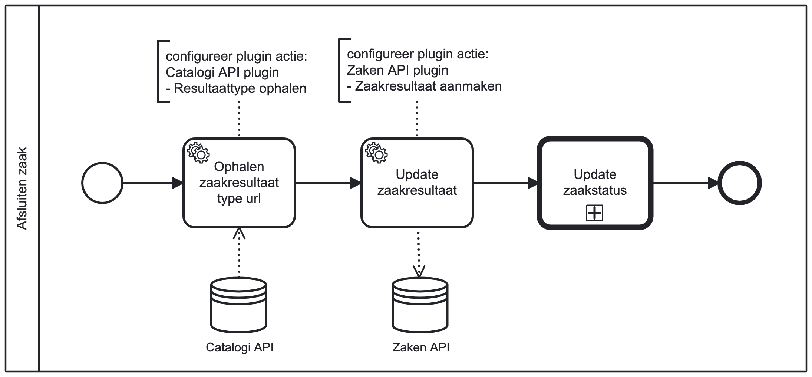

# Afsluiten zaak

## Inleiding
Het **Afsluiten zaak** bouwblok kan gebruikt worden om een Zaak in Zaken API af te sluiten doormiddel en resultaat en 
eindstatus te creëren.
Dit bouwblok maakt gebruik van de [Update zaakstatus](../update-zaakstatus) bouwblok. Het is verplicht om het 
`Update zaakstatus` bouwblok eerst op te zetten.
   
## Installatie
We gaan uit van een bestaande Valtimo GZAC backend repository met daarin een bestaand proces.
Dit bouwblok zou op Valtimo GZAC 10.7.0.RELEASE en hogere versies kunnen gebruikt worden.

Kopiëer de bestanden van de `config` directory naar de config directory van Valtimo GZAC (`src/main/resources/config/`)
en behoud dezelfde directory structuur.

## Aanroepen bouwblok

Het proces van dit blouwblok kan aangeroepen worden via een call activity (Called element: `afsluiten-zaak`) 
in een(hoofd)proces. De call activity moet de volgende variabelen doorsturen naar dit boublok:
- `resultaat`: de tekstuele waarde van het te creëren niuewe zaakresultaat
- `status`: de tekstuele waarde van het te creëren nieuwe zaakstatus
