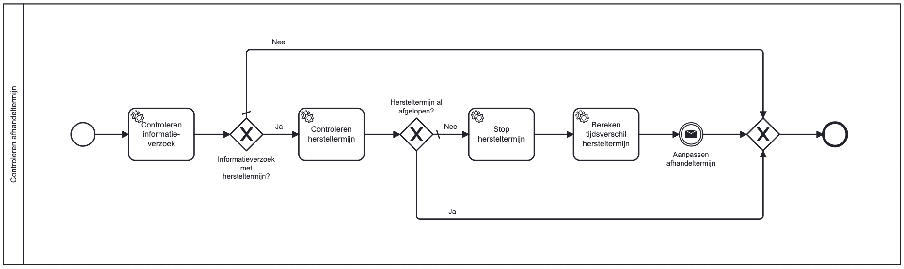

# Controleren afhandeltermijn

## Inleiding
Het **controleren afhandeltermijn** bouwblok kan gebruikt worden om te controleten 
of er een hertesltermijn aanwezig is bij een informatieverzoek en als nodig de doorlooptijd te berekenen.  
Het bouwblok biedt de mogelijkheid om: 
- TODO
- TODO
- TODO
- TODO
- TODO

## Installatie
We gaan uit van een bestaande Valtimo GZAC backend repository met daarin een bestaand proces.
Dit bouwblok zou op alle Valtimo GZAC 9.X.X.RELEASE, 10.X.X.RELEASE en 11.X.X.RELEASE versies kunnen gebruikt worden.

Kopiëer de bestanden van de `config` directory naar de config directory van Valtimo GZAC (`src/main/resources/config/`)
en behoud dezelfde directory structuur.

## Aanroepen bouwblok

Het proces van dit blouwblok kan aangeroepen worden via een call activity (Called element: `controleren-afhandeltermijn`) 
in een(hoofd)proces. Zie het voorbeeld hieronder:

