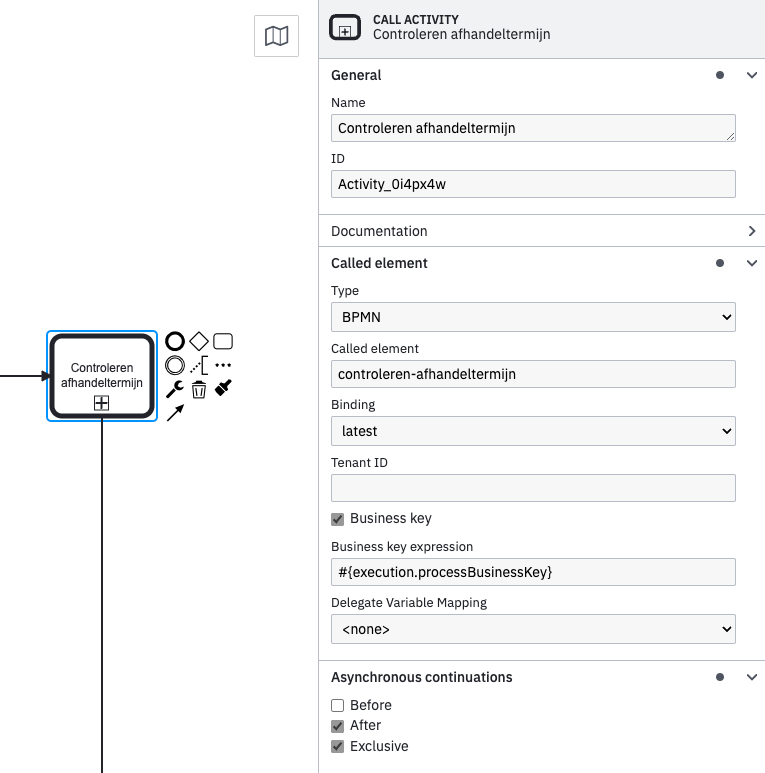

# Controleren afhandeltermijn

## Inleiding
Het **controleren afhandeltermijn** bouwblok kan gebruikt worden om te controleren 
of er een hersteltermijn aanwezig is bij een informatieverzoek en indien nodig de doorlooptijd ervan te berekenen.  
Het bouwblok kan: 
- controleren of een hersteltermijn van toepassing is.
- controleren of een hersteltermijn inmiddels als gestopt is.
- de eindtijd van de hersteltermijn vastleggen.
- het verschil tussen start- en eindtijd berekenen.
- het verschil teruggeven aan een hoger geleden proces.
   
## Installatie
We gaan uit van een bestaande Valtimo GZAC backend repository met daarin een bestaand proces.
Dit bouwblok zou op alle Valtimo GZAC 9.X.X.RELEASE, 10.X.X.RELEASE en 11.X.X.RELEASE versies kunnen gebruikt worden.

Kopiëer de bestanden van de `config` directory naar de config directory van Valtimo GZAC (`src/main/resources/config/`)
en behoud dezelfde directory structuur.

## Aanroepen bouwblok

Het proces van dit blouwblok kan aangeroepen worden via een call activity (Called element: `controleren-afhandeltermijn`) 
in een(hoofd)proces. Zie het voorbeeld hieronder:

