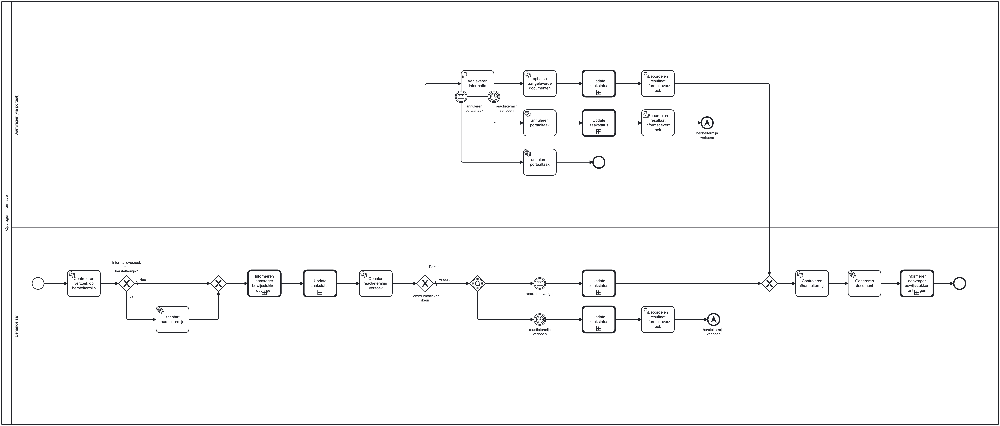

# Informeren aanvrager

## Inleiding
Het opvragen informatie bouwblok kan gebruikt worden om meer informatie bij een persoon (of bedrijf) op te vragen.
Het bouwblok biedt de mogelijkheid om:
- een portaaltaak open te zetten voor een persoon (of bedrijf) met de hulp van de portaaltaak plugin.
- een gebruikerstaak open te zetten voor een behandelaar om een reactie op een verzoek direct in GZAC vast te leggen.
- een doorlooptijd te berekenen en als nodig de afhandeltermijn aan the passen.

## Installatie
We gaan uit van een bestaande Valtimo GZAC backend repository met daarin een bestaand proces.
Dit bouwblok is getest op Valtimo GZAC 10.7.0.RELEASE.

Kopiëer de bestanden van de `config` directory naar de config directory van Valtimo GZAC (`src/main/resources/config/`)
en behoud dezelfde directory structuur.

## Aanroepen bouwblok

Dit blouwblok kan aangeroepen worden via een call activity (Called element: opvragen-informatie) in een (hoofd)proces.
Het bouwblok maakt gebruik van (minimaal) twee input proces variabelen:
* `communicatievoorkeur` - voor bepaling van sequence flows en de informeren-aanvrager bouwblok.
* `informatieverzoek` - de daadwerkelijke verzoek object. bevat variabelen zoals `hersteltermijn`, `duedate`, `toelichting` en `opTeVragenInformatie`.
wordt gebruikt voor plugin acties, user tasks en service tasks van dit process.

## Gebruiken bouwblok

Dit bouwblok heeft twee flows: 'Portaal' en 'Anders'.  
* Bij de 'Portaal' flow hoeft de behandelaar alleen de beoordeling taak af te ronden nadat een portaaltaak is verwerkt.  
* Bij de 'Anders' flow is het van belang dat de twee hulp (ad-hoc) processen aan de Dossier definitie worden gekoppeld (via process-document-link of manueel). Deze kunnen dan door de behandelaar aangeroepen worden, wanneer de gevraagde informatie op een andere manier wordt aangeleverd dan via de portaaltaak.
