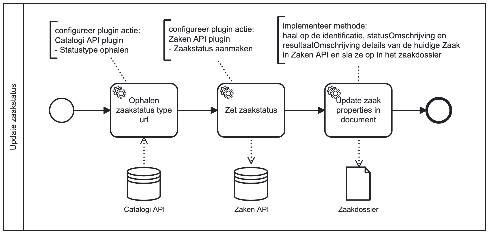

# Update zaakstatus

## Inleiding
Het **Update zaakstatus** bouwblok kan gebruikt worden om een status voor een Zaak in Zaken API aan te maken en volgens 
Zaak details opslaan in het zaakdossier binnen Valtimo GZAC.
   
## Installatie
We gaan uit van een bestaande Valtimo GZAC backend repository met daarin een bestaand proces.
Dit bouwblok zou op Valtimo GZAC 10.7.0.RELEASE en hogere versies kunnen gebruikt worden.

Kopiëer de bestanden van de `config` directory naar de config directory van Valtimo GZAC (`src/main/resources/config/`)
en behoud dezelfde directory structuur.

## Aanroepen bouwblok

Het proces van dit blouwblok kan aangeroepen worden via een call activity (Called element: `update-zaakstatus`) 
in een(hoofd)proces. De call activity moet de volgende variabelen doorsturen naar dit boublok:
- `status`: de tekstuele waarde van het te creëren nieuwe status
